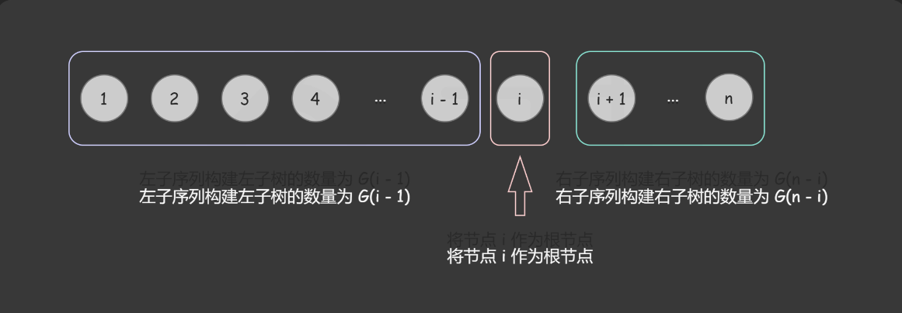

动态规划5步骤
1. dp数组和下标含义
2. 递推公式确定
3. 数组初始化
4. 遍历顺序
5. 举例推导

# 1-509-斐波那契

# 2-70-爬楼梯
假设你正在爬楼梯。需要 n 阶你才能到达楼顶。

每次你可以爬 1 或 2 个台阶。你有多少种不同的方法可以爬到楼顶呢？

示例 1：
输入：n = 2
输出：2
解释：有两种方法可以爬到楼顶。
1. 1 阶 + 1 阶
2. 2 阶

示例 2：
输入：n = 3
输出：3
解释：有三种方法可以爬到楼顶。
1. 1 阶 + 1 阶 + 1 阶
2. 1 阶 + 2 阶
3. 2 阶 + 1 阶

提示：

    1 <= n <= 45

## 思路
推导一下就知道, 本题的递推公式就是斐波那契,只不过下标相对于斐波那契那道题向后移了一位

# 3-746. 使用最小花费爬楼梯
## 题目
给你一个整数数组 cost ，其中 cost[i] 是从楼梯第 i 个台阶向上爬需要支付的费用。一旦你支付此费用，即可选择向上爬一个或者两个台阶。

你可以选择从下标为 0 或下标为 1 的台阶开始爬楼梯。

请你计算并返回达到楼梯顶部的最低花费。
示例 1：

输入：cost = [10,15,20]
输出：15
解释：你将从下标为 1 的台阶开始。
- 支付 15 ，向上爬两个台阶，到达楼梯顶部。
总花费为 15 。

示例 2：

输入：cost = [1,100,1,1,1,100,1,1,100,1]
输出：6
解释：你将从下标为 0 的台阶开始。
- 支付 1 ，向上爬两个台阶，到达下标为 2 的台阶。
- 支付 1 ，向上爬两个台阶，到达下标为 4 的台阶。
- 支付 1 ，向上爬两个台阶，到达下标为 6 的台阶。
- 支付 1 ，向上爬一个台阶，到达下标为 7 的台阶。
- 支付 1 ，向上爬两个台阶，到达下标为 9 的台阶。
- 支付 1 ，向上爬一个台阶，到达楼梯顶部。
总花费为 6 。

提示：
    2 <= cost.length <= 1000
    0 <= cost[i] <= 999

dp[i]:到达i需要的最小花费
dp[i]=min(dp[i-1]+cost[i-1],dp[i-2]+dp[i-2])
dp[0]=dp[1]=0,dp 长度和cost对应
递归就是从下标2开始向后递归
推导
   

# 4-62-不同路径
# 5-63-不同路径II
这道题难在初始化,在0行0列只要有障碍那么后面的就不用赋值为1
# 6-343-整数拆分
拆分10,10=2 * 8, 可以继续拆分8, 也就是dp[10]=2 * dp[8],这里注意,前面的2只是一种可能,需要遍历所有可能的前面的乘数,对一个数n只需要遍历n//2就行
# 7-96-二叉搜索树
给定一个有序序列 1⋯n，为了构建出一棵二叉搜索树，我们可以遍历每个数字 i，将该数字作为树根，将 1⋯(i−1) 序列作为左子树，将 (i+1)⋯n 序列作为右子树。接着我们可以按照同样的方式递归构建左子树和右子树。

这张图是提醒,递归的时候dp[i]+=dp[j-1]*dp[i-j], 左子树是j-1

# 01背包
对于一个容量为`bagweight`的背包,有多个物品, 它们的重量是 `weights:list`, 价值是 `values:list` ,在不超过容量的情况下,尽可能放入价值总和最大的物品

一维滚动递归:
倒序, 内层循环从dp末尾开始, 在内层循环中, start=bagweight, end=weight(也就是外层循环的i)
**注意**:一维的时候,内外层不能调换,但是二维的时候可以!也就是二维的时候可以外层是重量,内层是不同物品

# 8-416-分隔等和子集

# 9-1049-最后一块石头重量

# 11-494-目标和
## 思路
原数组nums, 目标target
加法总和x, 减法总和sum-x, x-(sum-x)=target--> x=(sum+target)/2
根据上面条件,将bagweight=(sum+target)/2(要先判断边界条件)
对于`dp[i][j]`: 在使用前i个num的时候对于target=j的情况有dp[i][j]的方法填满

递推公式:
dp[i][j]=dp[i-1][j]+dp[i-1][j-nums[i]], 即:在考虑需要使用nums[i]填满当前背包j的时候,要考虑:
1. 完全不使用nums[i]
2. 使用nums[i],因此需要先考虑把nums[i]空出来, 考虑使用前i-1个num填满j的方法

对于1维:
dp[j]+=dp[j-nums[i]]

# 12-474-10
三层循环,最外层依然是物品,内层分别是0数量和1数量
dp[i][j]=max(dp[i][j],dp[i-zero_num][j-one_num]+1)

# 完全背包
**与0-1背包的关键区别**:
每个物品都可以有无限个
二维递推公式:`dp[i][j]=max(dp[i-1][j],dp[i][j-weight[i]]+val[i])`
一维:`dp[j]=max(dp[j],dp[j-weight[i]]+val[i])`, 注意, 是**正序遍历**
完全背包的1维遍历,要注意的是:
**组合和排列的内外层不一样,是相反的**

# 13-518. 零钱兑换 II

给你一个整数数组 coins 表示不同面额的硬币，另给一个整数 amount 表示总金额。
请你计算并返回可以凑成总金额的硬币组合数。如果任何硬币组合都无法凑出总金额，返回 0 。
假设每一种面额的硬币有无限个。 
题目数据保证结果符合 32 位带符号整数。
示例 1：
输入：amount = 5, coins = [1, 2, 5]
输出：4
解释：有四种方式可以凑成总金额：
5=5
5=2+2+1
5=2+1+1+1
5=1+1+1+1+1
示例 2：
输入：amount = 3, coins = [2]
输出：0
解释：只用面额 2 的硬币不能凑成总金额 3 。
示例 3：
输入：amount = 10, coins = [10] 
输出：1
提示：
    1 <= coins.length <= 300
    1 <= coins[i] <= 5000
    coins 中的所有值 互不相同
    0 <= amount <= 5000

## 思路
这种方法数量类需要使用+=, 不需要初始化, 其他的和普通完全背包一个道理

# 14-377-组合总和IV
## 思路
求排列,要注意顺序,外层遍历背包,内层遍历物品

# 15-322-零钱兑换
## 思路
0 1 2 3 4 5 6 7 8 9 10 11
0 1 2 3 4 5 6 7 8 9 10 11
0 1 1 2 2 3 3 3 4 5 5  6
0 1 1 2 2 1 2 2 3 3 2  3
这里外层循环是物品,内层是背包,递推公式是min

# 16-279-完全平方数
## 思路
0 1 2 3 4 5 6 7 8 9 10 11 12 13
1 1 2 3 1 2 3 4 2 1 2  3  4  2
同[15-322-零钱兑换](#15-322-零钱兑换)差不多, 唯一需要注意的是需要自己构造

# 17-139-单词拆分
## 思路
反过来想,能否用给定的**无限单词子集正好填满原单词**?
转化成完全背包问题!
同时,这里需要考虑顺序,`'applepenapple'=='apple'+'pen'+'apple', 'applepenapple'!='apple'+'apple'+'pen'`, 要严格对应才行
同时注意, 这里s的长度当然是小于dp长度1格,dp[i]=True的意思是s[:i]可以正好分割成多个在给定词典的单词,不包括s[i]

# 18-198-打家劫舍
简单滴捏

# 19-213-抢劫II
只需要求两遍动规, 一次排除头, 一次排除尾, 然后取更大值就可以

# 20-337-抢劫
- 动规的话, 需要**后序遍历**, 同时DP数组长度为2, dp[0]为不抢当前节点, dp[1]为抢当前节点
- 同时注意, 在其中的分支情况中, 抢劫**可以一直不抢**, 也就是说即使不抢当前节点, 依然可以选择抢下一节点和不抢下一节点, 当然如果抢了当前节点那么只能选不抢下一层节点:
  ```python
    # 这里不抢现在节点可以不抢左子节点也不抢右子节点
    not_rob_curr=max(left[0],left[1])+max(right[0],right[1])
    # 这里抢了现在节点, 也只能不抢左右子节点
    rob_curr=node.val+left[0]+right[1]
    ```


